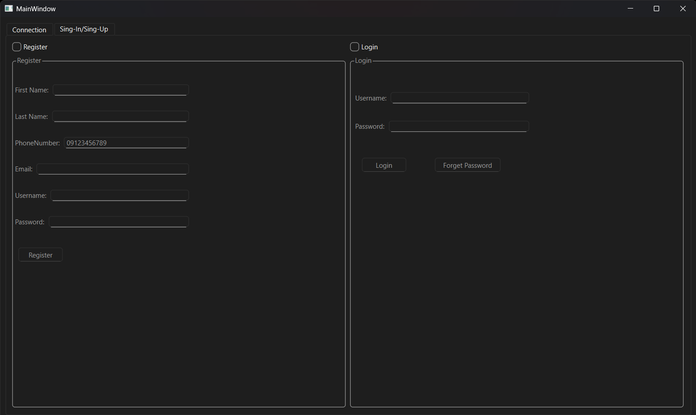
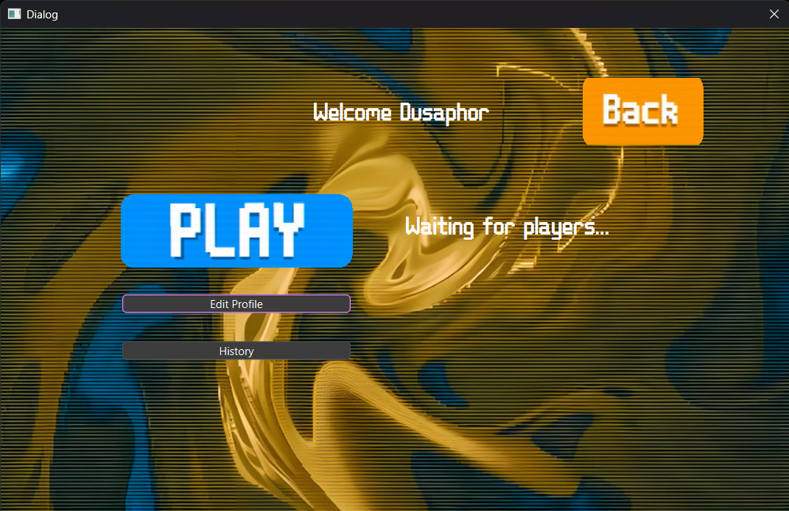

# Poffer-Game-Project
  
  
A two-player, turn-based card game written in C++ with the Qt framework.

---
- [Overview](#overview)
- [Pages](#pages)
- [Gameloop](#gameloop)   
- [Screenshots](#screenshots)  

---

## Overview

Poffer is a card-selection game for two players. The match is divided into **3 rounds**, each consisting of **5 turns**. On each turn, both players, one after another, pick one card. After 5 turns, each player’s “hand” (the five cards they chose) is scored based on:

- **Repetition frequency** (pairs, three-of-a-kind, etc.)  
- **Suit combinations** (flushes, mixed suits)

---
## Pages

This application uses a mix of `QDialog` and `QMainWindow` subclasses for its UI.  
### 1. Connection + Login/Register Page
The very first screen you come upon after running this program.
In this page you can connect to your local server using the IP address provided by server program then after establishing connection the register and login menus is available to you.

### 2. Game Main Menu
After login, the main menu offers you 3 options:  
1- Start a game  
2- Edit your profile  
3- Check the history of your earlier games  

by starting a game you'll be added to a waitlist until another player hits the start. 

### 3. Game Session  
This is where the match is played.

---

## Gameloop
1. **Game Initialization**  
   - Load a deck of 52 standard playing cards.  
   - Shuffle deck and deal an initial **draft pool** of 7 cards face-up.

2. **Round Loop** (×3)  
   - Reset each player’s hand.
   - Choose who plays first.  
   - Refill the deck of 52 cards.

3. **Turn Loop** (×5 per round)  
   1. **Player 1’s Turn**    
      - Player 1 selects one then it’s added to their hand and removed from the pool.
      - They have the option to exchange card with their opponent or pause the game.    
   2. **Player 2’s Turn**  
      - Repeat the selection for Player 2 with same options as Player 1.
      - Then discarding 5 remaining cards
   3. **Swap Players**
      - Now we have to swap the players
      - Then next turn.
  
   each turn for each player lasts only 30 seconds and after that a card is placed to the hand of player by server.  

4. **Scoring Phase**  
   - Once both players have 5 cards, calculate each hand’s value.  
   - Display the round winner.

5. **End of Match**  
   - After 3 rounds, compare round-win number of each player.
---

## Screenshots  
### Login/Register

### Main Menu

